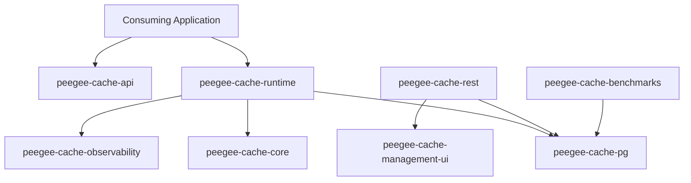

# Comprehensive Code Review Report: PeeGeeQ Cache (`peegee-cache`)

**Target Repository**: `peegee-cache` (PostgreSQL-Backed Cache & Coordination Library)  
**Date**: September 10, 2026  
**Scope**: Full Codebase Review across all 11 reactor modules  

---

## 1. Executive Summary & Architecture Overview

`peegee-cache` is a library-first, PostgreSQL-backed cache and coordination engine for Java and Vert.x environments. It provides Redis-inspired semantics (key-value caching, TTL expiry, atomic counters, distributed lease locks, namespace scanning, and pub/sub notifications) directly on PostgreSQL.

### Key Architectural Strengths
1. **Transactional Locality**: Business logic mutations, cache updates, and `pg_notify` notifications occur within a single database transaction envelope, eliminating cross-system consistency hazards.
2. **Strict Threading & Reactive Model**: Non-blocking asynchronous programming using Vert.x reactive SQL clients (`PgPool`). File system operations (fsync journal logging) are strictly offloaded to dedicated single-threaded workers.
3. **Defense-in-Depth Security**: REST management server implements fail-closed authentication (`LOCAL_TOKEN` stdout exchange or `TRUSTED_PROXY`), strict CSRF validation (`PGQMGMTSESSION` + `X-PeeGeeQ-CSRF`), and network target verification (`TargetPolicy` CIDR/DNS allowlists).
4. **PostgreSQL Engine Optimizations**: Utilizes `UNLOGGED` tables for high-throughput cache writes, HOT (Heap-Only Tuple) updates for counters/TTLs, partial indexes for expiry metadata, and PostgreSQL sequence-backed fencing tokens.

---

## 2. Module-by-Module Code Review

---

### A. API & Model Contracts (`peegee-cache-api` & `peegee-cache-core`)

* **Primary Interface**: [`PeeGeeCache.java`](file:///c:/Users/mraysmit/dev/idea-projects/peegeeq-cache/peegee-cache-api/src/main/java/dev/mars/peegeeq/cache/api/PeeGeeCache.java) exposes sub-services:
  - `CacheService`, `CounterService`, `LockService`, `ScanService`, `PubSubService`, and `AdminService`. The privileged `ManagementService` is owned by the management server's managed-setup runtime, not by the library facade.
* **Write-Behind Engine**:
  - [`WriteBehindBuffer.java`](file:///c:/Users/mraysmit/dev/idea-projects/peegeeq-cache/peegee-cache-core/src/main/java/dev/mars/peegeeq/cache/core/writebehind/WriteBehindBuffer.java): Thread-safe, bounded, last-write-wins buffer using `ConcurrentHashMap` and synchronized mutation locks for key-deduplication.
  - [`CompositeCacheTelemetry.java`](file:///c:/Users/mraysmit/dev/idea-projects/peegeeq-cache/peegee-cache-core/src/main/java/dev/mars/peegeeq/cache/core/telemetry/CompositeCacheTelemetry.java): Multiplexes telemetry events cleanly without imposing hard metrics vendor dependencies on core logic.

---

### B. PostgreSQL Execution Engine (`peegee-cache-pg`)

* **SQL Isolation & Security**:
  - [`LockSql.java`](file:///c:/Users/mraysmit/dev/idea-projects/peegeeq-cache/peegee-cache-pg/src/main/java/dev/mars/peegeeq/cache/pg/sql/LockSql.java), [`CacheSql.java`](file:///c:/Users/mraysmit/dev/idea-projects/peegeeq-cache/peegee-cache-pg/src/main/java/dev/mars/peegeeq/cache/pg/sql/CacheSql.java), and [`CounterSql.java`](file:///c:/Users/mraysmit/dev/idea-projects/peegeeq-cache/peegee-cache-pg/src/main/java/dev/mars/peegeeq/cache/pg/sql/CounterSql.java) isolate SQL generation.
  - **Schema Sanitization**: `LockSql` validates schema names against strict regex `Pattern.compile("[A-Za-z_][A-Za-z0-9_]*")`, guarding against SQL injection when formatting dynamic schema identifiers.
* **Distributed Lease Locks**:
  - Uses `INSERT ... ON CONFLICT DO NOTHING` combined with sequence-backed fencing tokens (`lock_fencing_seq`) to deliver linearizable lock acquisitions and re-entrant extensions.
* **Safe Logging**:
  - [`SafeLogValue.java`](file:///c:/Users/mraysmit/dev/idea-projects/peegeeq-cache/peegee-cache-pg/src/main/java/dev/mars/peegeeq/cache/pg/logging/SafeLogValue.java): Enforces fingerprinting (`SHA-256`) of user-supplied keys and namespaces, preventing raw key or value credential leaks into logging infrastructure.

---

### C. Runtime Lifecycle & Management (`peegee-cache-runtime`)

* **Managed Lifecycle**:
  - [`PgPeeGeeCacheManager.java`](file:///c:/Users/mraysmit/dev/idea-projects/peegeeq-cache/peegee-cache-runtime/src/main/java/dev/mars/peegeeq/cache/runtime/bootstrap/PgPeeGeeCacheManager.java): Controls pool lifecycle, background sweepers, and pub/sub listener reconnection logic.
* **Asynchronous Expiry Sweeper**:
  - [`PgExpirySweeper.java`](file:///c:/Users/mraysmit/dev/idea-projects/peegeeq-cache/peegee-cache-runtime/src/main/java/dev/mars/peegeeq/cache/runtime/expiry/PgExpirySweeper.java): Periodically removes expired TTL rows with bounded batching to prevent long-running table locks.
* **Flap & Noise Suppression**:
  - [`RecurringFailureTracker.java`](file:///c:/Users/mraysmit/dev/idea-projects/peegeeq-cache/peegee-cache-runtime/src/main/java/dev/mars/peegeeq/cache/runtime/logging/RecurringFailureTracker.java): Logs initial failures at `WARN`/`ERROR` level, suppresses repeated interval noise, and logs a summary upon recovery.

---

### D. REST Management Server (`peegee-cache-rest`)

* **Authentication & Security Architecture**:
  - [`LocalSessionRequestAuthenticator.java`](file:///c:/Users/mraysmit/dev/idea-projects/peegeeq-cache/peegee-cache-rest/src/main/java/dev/mars/peegeeq/cache/rest/server/LocalSessionRequestAuthenticator.java) & [`TrustedProxySessionRequestAuthenticator.java`](file:///c:/Users/mraysmit/dev/idea-projects/peegeeq-cache/peegee-cache-rest/src/main/java/dev/mars/peegeeq/cache/rest/server/TrustedProxySessionRequestAuthenticator.java): Support both isolated local token bootstrap and reverse-proxy header assertion.
  - **CSRF Defense**: Enforces `HttpOnly`, `SameSite=Strict` session cookies combined with custom `X-PeeGeeQ-CSRF` header checks.
* **Durable Audit Journal**:
  - [`DurableManagementAuditSink.java`](file:///c:/Users/mraysmit/dev/idea-projects/peegeeq-cache/peegee-cache-rest/src/main/java/dev/mars/peegeeq/cache/rest/audit/DurableManagementAuditSink.java): Implements two-phase audit reservations (intent -> execution -> outcome). Offloads JSONL formatting and `fsync` disk calls to a single-threaded platform executor (`peegeeq-management-audit`).

---

### E. Management UI (`peegee-cache-management-ui`)

* **Frontend Architecture**: React 18 + TypeScript + Ant Design 5 + RTK Query + Zustand.
* **API Integration**: Generates typed TypeScript clients directly from OpenAPI schemas (`openapi-typescript`).
* **Security Compliance**: Passes session tokens and CSRF headers in memory without placing secrets in browser `localStorage`.

---

### F. Observability & Benchmarks (`peegee-cache-observability` & `peegee-cache-benchmarks`)

* **Health Checks**:
  - [`PgCacheHealthIndicator.java`](file:///c:/Users/mraysmit/dev/idea-projects/peegeeq-cache/peegee-cache-observability/src/main/java/dev/mars/peegeeq/cache/observability/health/PgCacheHealthIndicator.java): Validates database connectivity, required schema views, migrations ledger, and manager operational state.
* **Benchmarking Engine**:
  - Includes `BenchmarkCheckpointWriter`, `BenchmarkCheckpointPipeline`, and rate-controlled workload schedulers to generate atomic HTML performance reports.

---

## 3. Detailed Evaluation Summary

| Area | Quality Score | Highlights | Areas for Enhancement |
|---|:---:|---|---|
| **Architecture & Layering** | **9.5/10** | Strict API/Impl separation; clean Vert.x async composition | Keep `prompt.md` updated or aligned with current repo state |
| **Concurrency & Thread Safety** | **9.5/10** | Non-blocking EventLoop design; file I/O offloaded to single-thread workers | Ensure background sweepers adapt interval under continuous load |
| **Security & Auditing** | **9.5/10** | Robust CSRF, target CIDR policy, HMAC audit key validation, key redaction | Ensure audit log rotation policies are integrated into host ops |
| **SQL & Database Performance** | **9.0/10** | UNLOGGED tables, sequence-backed lease locks, schema sanitization | Continue monitoring autovacuum on high-churn TTL tables |
| **Observability & Operations** | **9.5/10** | Structured SLF4J 2.0 key-values, Micrometer + OTel adapters, readiness probe | Ensure production metric alerts match recommended thresholds |

---

## 4. Key Recommendations

1. **Audit Journal Rotation Protocol**: Maintain strict host log rotation policies on `logs/management-audit.jsonl` to ensure high-frequency mutation audit journals do not cause disk capacity pressure.
2. **PostgreSQL Autovacuum Tuning**: For deployments with heavy key invalidation or short-lived TTLs, configure aggressive autovacuum parameters on the `cache_entries` table (`autovacuum_vacuum_scale_factor = 0.05`).
3. **SLF4J Provider Enforcement**: Continue enforcing the `LoggingDependencyContractTest` to ensure library modules never leak concrete SLF4J providers into downstream consumer projects.
