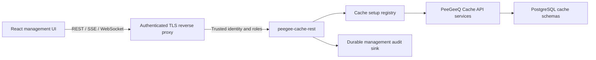

# PeeGeeQ Cache Management UI

**Status:** Approved design

**Date:** August 2026

**Version:** 0.1
**Audience:** PeeGeeQ Cache maintainers, UI developers, backend developers, operators, and test engineers

## 1. Purpose

This document defines the product, interaction, API, security, implementation, and test design for a management user interface for PeeGeeQ Cache.

The console follows the existing PeeGeeQ Management UI as its reference implementation. It reuses that product's visual language, frontend toolchain, embedded Vert.x serving model, setup-scoping pattern, live-status behavior, notifications, and real PostgreSQL end-to-end test architecture. Cache-specific workflows replace queue- and event-store-specific workflows.

PeeGeeQ Cache is currently a library, not a daemon. A usable browser console therefore requires two new modules:

- `peegee-cache-management-ui`: the React application.
- `peegee-cache-rest`: the Vert.x management API and static UI host.

The first release manages multiple PostgreSQL cache setups, exposes authoritative database state, supports guarded administrative operations, and keeps sensitive values masked unless an authorized operator explicitly reveals them.

The corresponding interactive screen designs are available in [the management UI mockups](UI%20mockups/peegeeq-cache-management-ui-mockups.html). The complete REST, streaming, security, error, and Java service contracts are defined in [PEEGEEQ_CACHE_MANAGEMENT_API.md](PEEGEEQ_CACHE_MANAGEMENT_API.md).

## 2. Fixed decisions

The following decisions are part of the approved design:

| Area | Decision |
|---|---|
| Deliverable | Full UX, API, backend, security, implementation, and test design |
| Visual design | Match the PeeGeeQ Management UI shell and interaction conventions |
| Connection model | Multiple registered cache setups |
| Administration | Full guarded administration |
| Authentication | Exactly one server mode: trusted-proxy identity or single-use loopback local-token bootstrap; both establish bounded management sessions |
| Sensitive data | Masked by default; explicit operator-only reveal with an audit event |
| Telemetry | Database truth first; process-local metrics are explicitly labelled |
| Design artifact | This single Markdown specification |
| Setup persistence | Startup-configured setups are durable; UI-added setups are memory-only |
| Audit authority | Durable fail-closed `ManagementAuditSink`; the UI activity feed is bounded, process-local, and non-authoritative |

## 3. Design principles

### 3.1 Preserve PeeGeeQ family consistency

The cache console must look and behave like the PeeGeeQ Management UI. It uses the same dark collapsible sidebar, light content area, page header, connection indicator, manual refresh control, notification drawer, Ant Design cards and tables, destructive confirmation patterns, setup scope selector, responsive breakpoints, and embedded `/ui/*` deployment shape.

Consistency does not require copying accidental implementation fragmentation. The cache console uses one clear owner for each class of state:

- RTK Query owns REST request state, caching, invalidation, and retry policy.
- Zustand owns selected scope, live connection state, and the notification drawer.
- Component state owns temporary form and modal state only.
- Zod validates data received over REST, SSE, and WebSocket boundaries.

### 3.2 Never imply unsupported cache semantics

PeeGeeQ Cache is PostgreSQL-backed and does not implement Redis clustering, memory eviction policies, shards, partition rebalancing, retained pub/sub history, or a global pub/sub channel catalogue. The UI must not present equivalent controls.

### 3.3 Prefer authoritative state

Counts and operational state shown as setup-wide facts must come from PostgreSQL. The cache's current operation counters and Micrometer timers are process-local. A standalone management server sees only operations performed through that process and cannot derive application-wide hit rate or latency.

The UI therefore distinguishes:

- **Database state:** setup-wide entries, counters, locks, expiry backlog, storage, connections, and schema readiness.
- **Console runtime:** management-server requests, active console subscriptions, local pool status, and local stream health.

The first release does not display target-wide hit rate or target-wide operation latency.

### 3.4 Make dangerous actions unmistakable

Single-resource mutations use clear confirmation and optimistic concurrency where available. Bulk entry deletion uses a server-generated preview, a short-lived single-use token, and an exact typed namespace confirmation. Locks are never included in bulk deletion.

### 3.5 Keep secrets out of ordinary data paths

Database passwords, cache values, and lock owner tokens must not appear in list responses, URLs, browser storage, telemetry tags, notifications, or logs. Reveal operations use dedicated endpoints and generate sanitized audit events.

## 4. External product research

The design borrows established operational patterns where they map truthfully to PeeGeeQ Cache.

### 4.1 Redis Insight

[Redis Insight](https://redis.io/docs/latest/develop/tools/insight/) provides connection management, namespace-grouped key browsing, key/value CRUD, human-readable formatters, database analysis, bulk actions with result summaries, and real-time tooling.

Adopted patterns:

- connection/setup management;
- namespace-oriented key browsing;
- STRING, JSON, LONG, UTF-8, hexadecimal, and byte-size presentation;
- analysis summaries for entry type and expiry distribution;
- previewed and summarized bulk entry deletion.

Not adopted:

- Redis CLI and command workbench;
- Redis-specific data structures;
- Redis profiler and slow log;
- eviction-policy and memory-limit controls.

[Redis monitoring guidance](https://redis.io/docs/latest/operate/rs/monitoring/observability/) emphasizes latency, hit rate, evictions, connections, CPU, network, and memory. PeeGeeQ Cache will show the applicable PostgreSQL and connection data but will not claim application-wide hit rate or latency until a shared telemetry source exists.

### 4.2 Apache Ignite

[Apache Ignite system views](https://ignite.apache.org/docs/ignite2/latest/monitoring-metrics/system-views) expose operational state through focused views for caches, nodes, client connections, queries, transactions, and partitions.

The cache console adopts this inspectable-view approach for namespaces, entries, counters, locks, connections, expiry state, and schema health. Ignite cluster and partition concepts are not copied.

### 4.3 Hazelcast Management Center

[Hazelcast cache monitoring](https://docs.hazelcast.com/management-center/latest/data-structures/cache) uses searchable resource lists, drill-down pages, time selectors, statistics, and throughput views.

The cache console adopts searchable namespace/resource tables and detail-page drill-down. Member and cluster breakdowns are excluded because PeeGeeQ Cache has no comparable topology.

### 4.4 Infinispan

[Infinispan metrics](https://infinispan.org/docs/stable/titles/metrics/metrics.html) organize health, entry counts, access results, timings, evictions, availability, and rebalancing.

The cache console adopts health and entry-state organization. Distributed availability, rebalancing, and eviction views are excluded.

## 5. Users and authorization

### 5.1 Viewer

A viewer can:

- list and inspect setups using secret-free metadata;
- view database health and readiness;
- browse namespaces, keys, counters, and locks without sensitive values;
- view masked audit activity and monitoring data;
- subscribe to a channel in the console without publishing.

A viewer cannot reveal cache values or owner tokens and cannot mutate cache state.

### 5.2 Operator

An operator has viewer access and can:

- reveal a cache value or lock owner token;
- create and update cache entries;
- change TTL or persistence;
- delete individual or selected cache entries;
- set, increment, decrement, expire, persist, and delete counters;
- force-release one lock using its observed version;
- publish a pub/sub message;
- register or detach a setup.

### 5.3 Authentication and management-session contract

Production deployments normally use trusted-proxy mode. The reverse proxy supplies normalized identity headers configured by the server. The default names are:

- `X-PeeGeeQ-User`
- `X-PeeGeeQ-Roles`

Roles are comma-separated and map to `viewer` or `operator`. The server:

- accepts trusted identity headers only from configured proxy addresses;
- rejects protected requests without an identity;
- rejects identity headers received from an untrusted peer;
- never accepts a role sent in a request body or query parameter;
- enforces authorization on the server independently of UI visibility;
- rejects duplicate, malformed, oversized, or unknown-role identity headers rather than partially accepting them.

For direct local operation, `LOCAL_TOKEN` mode binds only to loopback. Startup creates a cryptographically random 256-bit bootstrap token, exposes it once outside the logging system, and retains only its digest. `POST /api/v1/session/local` atomically consumes that token and creates the fixed `local-operator` identity. The token cannot be replayed or regenerated through HTTP.

Both authentication modes establish an in-memory `PGQMGMTSESSION` cookie with `HttpOnly`, `SameSite=Strict`, path `/`, and `Secure` under HTTPS. The default idle lifetime is 30 minutes, the default absolute lifetime is eight hours, and configuration cannot extend the absolute lifetime beyond 24 hours. `GET /api/v1/session` creates or refreshes the trusted-proxy session; identity or role changes invalidate it. Session and bootstrap secrets never enter browser persistence or logs.

Every state-changing request except the initial local-token exchange requires an allowed `Origin` and matching session-bound `X-PeeGeeQ-CSRF` value. The bootstrap exception is limited to loopback, exact same origin, JSON, the single-use token, disabled CORS, and a dedicated rate limit. SSE and WebSocket handshakes also validate the management session and origin. Exactly one authentication mode is configured; there is no anonymous mode.

The proxy must strip client-supplied identity headers before adding authoritative values and must terminate TLS for non-loopback use.

## 6. Information architecture

### 6.1 Application shell

The shell is structurally identical to the PeeGeeQ Management UI:

```text
┌──────────────────┬───────────────────────────────────────────────────────────┐
│ PeeGeeQ Cache    │ Page title      Setup / Namespace     ● Connected  ↻  🔔 │
│                  ├───────────────────────────────────────────────────────────┤
│ Overview         │                                                           │
│ Cache Setups     │                    Page content                           │
│ Namespaces       │                                                           │
│ Key Browser      │                                                           │
│ Counters         │                                                           │
│ Locks            │                                                           │
│ Pub/Sub          │                                                           │
│ Monitoring       │                                                           │
│ Settings         │                                                           │
└──────────────────┴───────────────────────────────────────────────────────────┘
```

The sidebar collapses to icons at the same breakpoint and width as the reference UI. The header remains visible while page content scrolls. The notification drawer opens from the header without navigation.

### 6.2 Routes

| Route | Page |
|---|---|
| `/` | Overview |
| `/cache-setups` | Cache Setups |
| `/namespaces` | Namespaces |
| `/namespaces/:encodedNamespace` | Namespace Details |
| `/keys` | Key Browser |
| `/keys/:encodedNamespace/:encodedKey` | Key Details |
| `/counters` | Counters |
| `/locks` | Locks |
| `/pubsub` | Pub/Sub |
| `/monitoring` | Monitoring |
| `/settings` | Settings |

Keys and namespaces in route segments use unpadded Base64 URL encoding of their UTF-8 bytes through one shared, tested helper. This preserves arbitrary identifiers without treating `/`, `%`, `+`, or `:` as route syntax. Raw values and owner tokens never enter URLs.

### 6.3 Scope behavior

The header contains a setup selector. Pages that address cache resources also contain a namespace selector with an `All namespaces` option where the operation is safe.

- Changing setup clears any namespace that is not available in the new setup.
- Scope is stored in session storage, not local storage.
- A missing or disconnected setup produces an actionable empty state.
- Destructive dialogs repeat the active setup and namespace and never rely on header context alone.

## 7. Page specifications

### 7.1 Overview

The Overview page answers: Is the selected setup healthy, what does it contain, and is expiry/coordination operating normally?

Top-level cards:

- setup status and database round-trip latency;
- live cache entries;
- live counters;
- active locks;
- expired rows awaiting physical cleanup;
- total cache schema storage.

Charts and tables:

- live versus expired entries over the current console session;
- expiry backlog and sweeper deletion results;
- entry value-type distribution;
- table and index storage by resource;
- PostgreSQL and management pool connections;
- console-local operation rate, explicitly labelled `Management server activity`;
- namespace overview table;
- bounded recent activity table.

The page shows a reconnecting banner when SSE or WebSocket connectivity is interrupted and removes it after recovery. Stale data remains visible with a timestamp and stale marker.

### 7.2 Cache Setups

The setup table contains:

- display name and setup identifier;
- host, port, database, and cache schema;
- SSL mode;
- source: startup configuration or UI session;
- connection, schema, and runtime status;
- last successful health check;
- actions allowed by role and source.

Setup registration asks for host, port, database, username, password, schema, SSL mode, and pool limits. It performs a connection and schema-readiness test before registration completes.

Passwords:

- use a password input;
- are sent only in the registration request body over TLS;
- remain in server memory only for UI-added setups;
- are never returned by an API;
- are cleared from form state after submission;
- are never written to Redux, Zustand, session storage, local storage, logs, errors, or notifications.

`Detach` closes the management runtime and pool without dropping schemas or data. Database/schema drop operations are not part of V1.

### 7.3 Namespaces

The table supports prefix search and cursor pagination. Each row shows:

- namespace;
- live entry count;
- live counter count;
- active lock count;
- expiring entry count;
- expired entry count awaiting cleanup;
- estimated storage;
- last observed update time when available.

Namespace Details contains Overview, Entries, Counters, and Locks tabs. It does not offer a single `Delete namespace` operation.

### 7.4 Key Browser

Filters:

- setup and namespace;
- key prefix;
- value type;
- live entries or include expired;
- persistent, expiring, or expired TTL state.

Columns:

- selection;
- key;
- value type;
- byte size;
- version;
- created and updated timestamps;
- expiry and remaining TTL;
- status;
- actions.

The list endpoint never includes values. The result is cursor-paginated and retains the active cursor stack so Back returns to the preceding page without rescanning from the beginning.

The browser supports creating an entry and deleting individual or selected entries. Bulk selection applies only to the result set represented by the server preview, not silently to future matches.

### 7.5 Key Details

The details page initially loads metadata only. The value panel displays `Masked` and a Reveal action for operators.

Supported formatters:

| Value type | Views |
|---|---|
| `STRING` | UTF-8 text and escaped text |
| `JSON` | formatted tree, formatted text, raw UTF-8, and validation state |
| `LONG` | decimal value |
| `BYTES` | hexadecimal, base64, UTF-8 attempt, and size |

Reveal responses are marked `Cache-Control: no-store`. Revealed values stay only in component memory and are cleared on route change, setup change, namespace change, browser visibility timeout, or explicit Hide.

Edit operations expose the existing set modes:

- always/upsert;
- only if absent;
- only if present;
- only if the observed version still matches.

Editing an existing entry defaults to version matching. A conflict reloads metadata and offers comparison; it never silently overwrites.

TTL actions:

- set a positive duration;
- make persistent;
- touch while retaining TTL;
- touch and refresh TTL.

The UI does not present `hit_count` or `last_accessed_at` as meaningful usage information in V1 because normal cache reads do not currently maintain those fields.

### 7.6 Counters

The table shows namespace, key, current value, version, timestamps, expiry, and status. Operators can:

- set an exact value;
- increment or decrement by a signed amount;
- set or remove TTL;
- delete one counter or explicitly selected counters.

Mutation responses always display the resulting server value. Counter deletion is not included in cache-entry bulk deletion.

### 7.7 Locks

The lock table shows namespace, key, fencing token, version, created/updated time, lease expiry, remaining lease, and owner status.

Owner tokens are masked. An operator may reveal one owner token through a dedicated endpoint; the value is never included in the list or ordinary detail response.

Forced release requires:

- operator role;
- current lock metadata loaded immediately before confirmation;
- exact lock key confirmation;
- the observed lock version;
- a server-side `DELETE ... WHERE namespace = ? AND lock_key = ? AND version = ?` equivalent.

A changed version returns a conflict and leaves the lock untouched. The console does not acquire or renew application locks in V1.

### 7.8 Pub/Sub

PostgreSQL pub/sub does not provide a reliable global list of channels or retained messages. The page therefore manages console subscription sessions.

An operator or viewer enters a channel and starts an SSE stream. The page displays received time, channel, content type, payload size, and a masked payload. Operator reveal follows the same no-store and audit rules as cache values.

Operators can publish text or JSON up to the configured cache payload limit. The form shows encoded byte length and disables publishing when the limit is exceeded. Closing the tab or stopping the session closes the subscription.

Native PostgreSQL notifications do not carry content type, so received messages display `contentType: null`; the console does not infer it from payload text. A successful publish displays `accepted: true`, meaning PostgreSQL accepted `pg_notify`, never a listener count or delivery guarantee. Publish is never automatically retried.

Creating a console subscription returns an opaque subscription identifier. Received messages are assigned opaque identifiers and retained in a bounded server-side session buffer so an operator can explicitly reveal one payload. Stopping the subscription, detaching the setup, expiring the session, or restarting the server removes that buffer. The displayed message history is explicitly labelled non-durable.

### 7.9 Monitoring

Database-wide sections:

- health and query latency;
- schema/migration readiness;
- cache entries, counters, locks, and expired rows;
- table, index, and total schema bytes;
- dead tuples and autovacuum timestamps when permissions allow;
- database connection counts when permissions allow.

Console-runtime sections:

- runtime started state;
- active management operations;
- management pool active, idle, pending, and maximum connections;
- active console pub/sub subscriptions;
- expiry sweeper state and last run;
- local operation counts and timings;
- SSE and WebSocket connection state.

Permission-limited PostgreSQL statistics appear as `Unavailable with current database permissions`, not as zero.

### 7.10 Notifications and recent activity

WebSocket events feed the header notification drawer and Overview activity table. Events include:

- setup connected, disconnected, unhealthy, or recovered;
- cache entry created, changed, expired, persisted, or deleted through the console;
- counter mutation;
- forced lock release;
- pub/sub publish;
- sensitive value reveal;
- bulk preview, completion, partial failure, or expiry;
- live-stream disconnected or recovered.

Payloads, database passwords, and owner tokens are never included. The feed is a bounded process-local convenience and resets when the management server restarts.

### 7.11 Settings

Settings displays:

- management API endpoint;
- authenticated user and mapped role;
- REST, SSE, and WebSocket status;
- refresh and reconnect preferences;
- date/time and byte-display preferences;
- masked-value auto-hide duration;
- application and API versions;
- links to health and capability data.

Security-critical policy is server-configured and read-only in the browser.

## 8. Frontend implementation

### 8.1 Stack

Use the same major frontend stack and build shape as `peegeeq-management-ui`:

- React 18;
- TypeScript;
- Vite 6;
- Ant Design 5;
- React Router;
- Redux Toolkit and RTK Query;
- Zustand;
- Zod;
- Recharts;
- Vitest and Testing Library;
- Playwright;
- Node 22.12 and npm 10.2 unless the reference project is deliberately upgraded first.

### 8.2 State ownership

| State | Owner |
|---|---|
| REST data and request status | RTK Query |
| Selected setup and namespace | Zustand scope store, mirrored to session storage |
| SSE/WebSocket status | Zustand connection store |
| Notification drawer | Zustand notification store |
| Revealed sensitive value | Detail component memory only |
| Form input | Form/component state |

There are no direct page-level Axios calls. The API layer defines tags for `Setup`, `Overview`, `Namespace`, `Entry`, `Counter`, `Lock`, `Monitoring`, and `Capabilities`.

### 8.3 Error behavior

- Validation errors remain attached to their fields.
- Authorization failures explain the required role without exposing server policy internals.
- Conflicts preserve user input and offer reload.
- Disconnection preserves stale data with a timestamp.
- Failed mutations never apply optimistic success UI.
- No exception is caught and ignored.

## 9. Backend architecture



### 9.1 Modules

`peegee-cache-rest` depends on typed cache API/runtime interfaces and supplies:

- HTTP server lifecycle and configuration;
- setup registry and connection ownership;
- authentication/authorization middleware;
- JSON request/response handlers;
- SSE and WebSocket lifecycle management;
- capability discovery;
- bulk-confirmation token storage;
- structured audit events;
- static `webroot` serving with SPA fallback.

Both modules are Maven children of the root reactor. `peegee-cache-management-ui` owns the Node/Vite build and exposes its compiled webroot as a Maven artifact; `peegee-cache-rest` consumes that artifact during packaging. Generated frontend output is never written into another module's source tree. The backend remains buildable through the root reactor before Phase 8.3 by using an explicitly empty, validated UI artifact.

### 9.2 Default ports and paths

- REST/static server: `127.0.0.1:8089`
- Vite development server: `127.0.0.1:3001`
- REST prefix: `/api/v1`
- UI: `/ui/*`
- WebSocket: `/ws/monitoring`

Vite proxies `/api` and `/ws` to port `8089` in development.

### 9.3 Setup registry

Startup-configured setups are read from server configuration. Their secrets are supplied by environment variables or secret references and are never exposed through the API.

UI-added setups:

- exist only in management-server memory;
- own one `PgPeeGeeCacheManager` and its pool;
- are closed on detach or server shutdown;
- disappear after restart;
- never write credentials to disk.

Concurrent connect/detach operations for one setup are serialized. Disconnecting a setup closes its SSE and WebSocket subscriptions with a typed terminal event.

## 10. REST and streaming contracts

### 10.1 Common response rules

- JSON uses camelCase.
- Timestamps use UTC ISO-8601.
- Durations crossing the HTTP boundary use integer milliseconds.
- Cursor values are opaque.
- List endpoints enforce a maximum page size.
- PostgreSQL/Java 64-bit integers use decimal strings; durations remain bounded integer milliseconds.
- Errors use RFC 9457-style `application/problem+json` with `type`, `title`, `status`, `code`, safe `detail`, `instance`, `correlationId`, and `fieldErrors`.
- Responses containing revealed data use `Cache-Control: no-store`.
- Passwords, values, and owner tokens are removed before logging.

### 10.2 Setup and capability endpoints

| Method | Path | Role | Purpose |
|---|---|---|---|
| `GET` | `/api/v1/session` | authenticated | Current identity, roles, bounded session, CSRF token, and API version |
| `POST` | `/api/v1/session/local` | loopback bootstrap | Atomically exchange the single-use local token for a bounded session |
| `DELETE` | `/api/v1/session/local` | authenticated local operator | Invalidate the local session; requires Origin and CSRF |
| `GET` | `/api/v1/setups` | viewer | List secret-free setup summaries |
| `POST` | `/api/v1/setups/actions/test` | operator | Test an unregistered connection without saving it |
| `POST` | `/api/v1/setups` | operator | Register and connect an in-memory setup |
| `GET` | `/api/v1/setups/:setupId` | viewer | Setup details |
| `POST` | `/api/v1/setups/:setupId/test` | operator | Test registered connection and schema readiness |
| `POST` | `/api/v1/setups/:setupId/connect` | operator | Reconnect a detached setup |
| `POST` | `/api/v1/setups/:setupId/detach` | operator | Close without changing data |
| `DELETE` | `/api/v1/setups/:setupId` | operator | Forget a UI-session setup |
| `GET` | `/api/v1/setups/:setupId/health` | viewer | Setup health |
| `GET` | `/api/v1/setups/:setupId/capabilities` | viewer | Feature availability |

Capability response:

```json
{
  "namespaceInspection": true,
  "expiredEntryInspection": true,
  "counterInspection": true,
  "lockInspection": true,
  "forcedLockRelease": true,
  "bulkEntryDelete": true,
  "bulkCounterDelete": true,
  "pubSub": true,
  "databaseStatistics": true,
  "sensitiveValueReveal": true
}
```

Health/setup detail also reports migration version decimal string `"1"`, corresponding to the current V001 baseline. Later versions are reported from the migration ledger rather than inferred from table presence.

The UI hides unavailable navigation destinations and disables unavailable actions. Authorization remains independently enforced.

### 10.3 Overview and inspection endpoints

| Method | Path | Purpose |
|---|---|---|
| `GET` | `/api/v1/setups/:setupId/overview` | Database-wide overview |
| `GET` | `/api/v1/setups/:setupId/namespaces` | Cursor-paginated namespace summaries |
| `GET` | `/api/v1/setups/:setupId/namespaces/export` | Export namespace metadata |
| `GET` | `/api/v1/setups/:setupId/namespaces/:encodedNamespace` | Namespace summary |
| `GET` | `/api/v1/setups/:setupId/monitoring/database` | PostgreSQL state |
| `GET` | `/api/v1/setups/:setupId/monitoring/runtime` | Console-local runtime state |
| `GET` | `/api/v1/setups/:setupId/activity` | Bounded sanitized activity |

### 10.4 Entry endpoints

| Method | Path | Role | Purpose |
|---|---|---|---|
| `GET` | `/api/v1/setups/:setupId/namespaces/:encodedNamespace/entries` | viewer | Metadata-only scan |
| `GET` | `/api/v1/setups/:setupId/namespaces/:encodedNamespace/entries/:encodedKey` | viewer | Metadata-only details |
| `POST` | `/api/v1/setups/:setupId/namespaces/:encodedNamespace/entries/:encodedKey/value/reveal` | operator | Reveal value and audit |
| `PUT` | `/api/v1/setups/:setupId/namespaces/:encodedNamespace/entries/:encodedKey` | operator | Create or update |
| `DELETE` | `/api/v1/setups/:setupId/namespaces/:encodedNamespace/entries/:encodedKey` | operator | Version-checked delete using `If-Match` |
| `POST` | `/api/v1/setups/:setupId/namespaces/:encodedNamespace/entries/:encodedKey/ttl` | operator | Set TTL |
| `POST` | `/api/v1/setups/:setupId/namespaces/:encodedNamespace/entries/:encodedKey/persist` | operator | Remove TTL |
| `POST` | `/api/v1/setups/:setupId/namespaces/:encodedNamespace/entries/:encodedKey/touch` | operator | Touch or refresh TTL |
| `POST` | `/api/v1/setups/:setupId/namespaces/:encodedNamespace/entries/bulk-delete/preview` | operator | Resolve and preview exact targets |
| `POST` | `/api/v1/setups/:setupId/namespaces/:encodedNamespace/entries/bulk-delete/execute` | operator | Execute confirmed preview |

Individual deletion requires the version observed by the details or browser response in an `If-Match` header. A changed version returns `412 Precondition Failed` and leaves the entry untouched.

Bulk preview resolves an immutable set of `(key, version)` targets and returns the filter, exact resolved count, bounded key sample, one-time token, confirmation phrase, and expiry time. Execute rejects expired, reused, differently scoped, or differently filtered tokens and deletes only entries whose versions still match the preview. Changed or missing entries are reported as conflicts rather than deleted. Partial failure returns processed, deleted, conflicted, and failed counts with sanitized failures.

### 10.5 Counter endpoints

| Method | Path | Role | Purpose |
|---|---|---|---|
| `GET` | `/api/v1/setups/:setupId/counters` | viewer | Scan counter metadata and values |
| `GET` | `/api/v1/setups/:setupId/namespaces/:encodedNamespace/counters/:encodedKey` | viewer | Counter details and version |
| `PUT` | `/api/v1/setups/:setupId/namespaces/:encodedNamespace/counters/:encodedKey` | operator | Set exact value and TTL mode |
| `POST` | `/api/v1/setups/:setupId/namespaces/:encodedNamespace/counters/:encodedKey/increment` | operator | Apply signed delta |
| `POST` | `/api/v1/setups/:setupId/namespaces/:encodedNamespace/counters/:encodedKey/ttl` | operator | Set TTL |
| `POST` | `/api/v1/setups/:setupId/namespaces/:encodedNamespace/counters/:encodedKey/persist` | operator | Remove TTL |
| `DELETE` | `/api/v1/setups/:setupId/namespaces/:encodedNamespace/counters/:encodedKey` | operator | Delete one counter |
| `POST` | `/api/v1/setups/:setupId/counters/bulk-delete/preview` | operator | Preview explicitly selected counter deletion |
| `POST` | `/api/v1/setups/:setupId/counters/bulk-delete/execute` | operator | Execute selected counter deletion |

Counter values are operational numeric state, not masked cache payloads.

### 10.6 Lock endpoints

| Method | Path | Role | Purpose |
|---|---|---|---|
| `GET` | `/api/v1/setups/:setupId/locks` | viewer | Scan active locks without owner tokens |
| `GET` | `/api/v1/setups/:setupId/namespaces/:encodedNamespace/locks/:encodedKey` | viewer | Current lock metadata |
| `POST` | `/api/v1/setups/:setupId/namespaces/:encodedNamespace/locks/:encodedKey/owner/reveal` | operator | Reveal owner token and audit |
| `POST` | `/api/v1/setups/:setupId/namespaces/:encodedNamespace/locks/:encodedKey/force-release` | operator | Version-checked forced release |

### 10.7 Pub/sub and live endpoints

| Method | Path | Role | Purpose |
|---|---|---|---|
| `POST` | `/api/v1/setups/:setupId/pubsub/subscriptions` | viewer | Create a bounded console subscription session |
| `GET` | `/api/v1/setups/:setupId/pubsub/subscriptions/:subscriptionId/stream` | viewer | Stream message metadata over SSE |
| `POST` | `/api/v1/setups/:setupId/pubsub/subscriptions/:subscriptionId/messages/:messageId/payload/reveal` | operator | Reveal one retained session payload and audit |
| `DELETE` | `/api/v1/setups/:setupId/pubsub/subscriptions/:subscriptionId` | viewer | Stop and clear a console subscription |
| `POST` | `/api/v1/setups/:setupId/pubsub/publish` | operator | Publish one message |
| `GET` | `/api/v1/setups/:setupId/sse/metrics` | viewer | Overview/monitoring snapshots |
| `GET` | `/ws/monitoring` | viewer | Health, activity, and resource notifications |

Every stream sends a typed initial snapshot or `ready` event, periodic heartbeat, monotonic event identifier, and typed terminal reason. Clients reconnect with bounded exponential backoff and jitter.

## 11. Java API additions

Management inspection and mutation must remain typed and testable without making REST handlers depend on PostgreSQL implementation classes.

A new `ManagementService`, exposed through a backward-compatible default `PeeGeeCache.management()` accessor, provides the exact typed signatures in [the authoritative Java API contract](PEEGEEQ_CACHE_MANAGEMENT_API.md#16-java-api-contract). Sensitive, mutation, and actor-bound bulk methods require a `ManagementActionContext`; reveals return versioned snapshot DTOs; mutations return `ManagementSetResult` or `VersionedMutationResult<T>` with `APPLIED`, `NOT_FOUND`, `VERSION_MISMATCH`, or `CONDITION_NOT_MET`.

The default accessor reports unsupported capability and its service methods return a failed `Future`. The PostgreSQL implementation supports the complete V1 contract. REST always checks capabilities before invoking an optional operation. Existing application-facing cache, counter, lock, scan, pub/sub, and admin contracts remain unchanged.

New immutable models include:

- `AdminPage<T>` with `items`, `nextCursor`, and `hasMore`;
- `NamespaceQuery` and `NamespaceStats`;
- `CounterQuery` and `CounterEntry`;
- `LockQuery`;
- `DatabaseStats` and permission-aware optional sections;
- `ExpiryStats`;
- `EntryTtlMode` with `PRESERVE_EXISTING`, `USE_DEFAULT`, `REPLACE`, and `REMOVE`;
- management entry/counter set, adjust, TTL, touch, and versioned delete requests;
- `VersionedEntryDeleteRequest` containing key and expected version;
- `EntryDeleteFilter`;
- `BulkDeletePreview`, `ConfirmedEntryDelete`, and `BulkDeleteResult`;
- `RevealedEntryValue` and `RevealedLockOwner`, each carrying value/owner and version from one database snapshot;
- `ManagementActionContext` containing authenticated actor, bounded roles, correlation identifier, and sanitized source address;
- `VersionedMutationResult<T>`, `ManagementMutationOutcome`, and `ManagementSetResult`;
- `ForceReleaseLockRequest` containing key, expected version, confirmation key, and optional bounded reason;
- `AdminCapabilities`.

Existing `MetricsSnapshot`, `CacheService`, `CounterService`, `LockService`, `PubSubService`, `ScanService`, and `AdminService` contracts remain unchanged.

## 12. Security and privacy

### 12.1 Sensitive response isolation

Metadata responses cannot contain value fields, binary buffers, owner tokens, or passwords. Reveal responses use dedicated DTOs and serializers. Static architecture tests scan DTOs and routes to enforce this boundary.

### 12.2 Audit event

Before each reveal or mutation, the configured `ManagementAuditSink` must durably accept a bounded intent and reserve capacity for one terminal outcome. If it cannot, the operation fails closed before database work with `503 AUDIT_UNAVAILABLE`. After database work, the reservation is completed idempotently as `SUCCEEDED`, `REJECTED`, `FAILED`, or `UNKNOWN`; conflicting second completion is rejected. Incomplete durable intents recover as `UNKNOWN` on restart. Failure to persist a possibly committed terminal outcome returns uncertain `503 AUDIT_OUTCOME_UNAVAILABLE`, marks mutation readiness down, and blocks further reveals/mutations until recovery.

The intent and outcome contain:

- event identifier and timestamp;
- correlation identifier;
- authenticated actor and role;
- action and outcome;
- setup and resource type;
- versioned, at-least-128-bit HMAC-SHA-256 fingerprints of user-controlled identifiers, produced with a server-held rotation key and accompanied only by its non-secret key identifier;
- non-sensitive request metadata;
- sanitized failure category.

The event must not contain a raw namespace/key/channel/prefix/cursor, cache value or derived hash/preview, pub/sub payload, lock owner token, database username/password, authorization header, request SQL, or stack trace. The bounded activity feed may show raw identifiers to authorized viewers but is not the audit authority.

### 12.3 Bulk confirmation storage

Confirmation tokens are random, single-use, scoped to actor/setup/namespace/filter, and expire after five minutes. Only a digest is retained in server memory. Restarting the server invalidates every token.

### 12.4 Browser handling

- Sensitive responses use `no-store`.
- Revealed content never enters Redux, Zustand, browser storage, URL state, notifications, or analytics.
- Copy actions require explicit user interaction.
- Hidden/revealed state resets after the configured timeout and on scope/navigation changes.
- Content is rendered as text; JSON and byte formatters never inject HTML.

## 13. Testing strategy

Mockito and substitute mocking frameworks are prohibited. Tests exercise observable behavior using real implementations, PostgreSQL Testcontainers, protocol fixtures, and full browser workflows.

### 13.1 Backend tests

JUnit and real PostgreSQL cover:

- startup-configured and in-memory setup lifecycle;
- concurrent connect/detach serialization and cleanup;
- custom cache schema support;
- namespace, counter, lock, expiry, and database statistics;
- cursor pagination with concurrent inserts/deletes;
- expired versus live visibility;
- value and owner-token redaction in metadata responses;
- reveal authorization, no-store headers, and sanitized audit events;
- entry create/update/CAS conflict/TTL/persist/touch/delete;
- counter arithmetic and TTL behavior;
- stale-version forced lock release;
- bulk preview scope, expiry, reuse, mismatch, partial failure, and cleanup;
- pub/sub serialization, payload limits, disconnect, and reconnect;
- PostgreSQL channel-byte limits, nullable received content type, and publication-acceptance semantics;
- single-use local-token exchange, bounded sessions, Origin/CSRF enforcement, and bootstrap exception isolation;
- durable audit reservation, terminal completion, recovery to `UNKNOWN`, and keyed fingerprint redaction;
- trusted versus untrusted proxy requests;
- missing/invalid roles and forbidden mutations;
- graceful shutdown of pools, subscriptions, SSE clients, and WebSockets.

### 13.2 Frontend tests

Vitest and Testing Library cover:

- route and menu mapping;
- scope transitions;
- loading, empty, stale, error, and reconnect states;
- role-based action visibility;
- capability-based page/action visibility;
- value masking, reveal, auto-hide, and state clearing;
- formatter correctness;
- conflict and validation presentation;
- bulk confirmation phrase and token expiry;
- responsive navigation and keyboard interaction.

Purpose-built HTTP/SSE/WebSocket fixtures may be used for browser protocol states. They must behave like the real protocol and must not replace backend integration coverage.

### 13.3 End-to-end tests

Playwright mirrors the PeeGeeQ Management UI environment:

- start a fresh PostgreSQL Testcontainer;
- bootstrap the current PeeGeeQ Cache schema;
- start the current management backend against the dynamic database port;
- start Vite against the dynamic backend;
- execute explicit dependency projects with one worker where database state is shared;
- shut down every server, pool, subscription, and container.

Required journeys include:

1. authenticate through both the test proxy and single-use local-token modes and register a setup;
2. switch setup/namespace scope and validate Overview counts;
3. create, browse, reveal, edit with CAS, expire, persist, touch, and delete a key;
4. preview and confirm selected-entry deletion and reject a stale preview;
5. set and mutate a counter;
6. observe a real lock and reject stale forced release before releasing the current version;
7. subscribe, publish, receive, disconnect, and recover pub/sub;
8. verify viewer/operator boundaries by calling the real API;
9. prove values, tokens, and passwords are absent from list responses, logs, storage, URLs, and notifications;
10. recover from backend/SSE/WebSocket interruption without showing fresh data as stale or stale data as fresh.

### 13.4 Static safety checks

Automated checks must prove:

- forbidden secret fields cannot appear in metadata DTOs;
- list handlers do not call value-reveal operations;
- every mutation route declares operator authorization;
- every reveal and mutation emits an audit event;
- bulk execution cannot be called without preview validation;
- no Mockito dependencies, imports, extensions, agents, or configuration exist;
- no empty catch blocks or ignored asynchronous failures exist.

## 14. Implementation phases

### Phase 1: Foundation

- Add the REST and UI modules and parent build wiring.
- Reproduce the PeeGeeQ shell, theme, routing, header, scope, connection status, and notification drawer.
- Implement configuration, setup registry, proxy security, capability discovery, health, static serving, and cleanup.
- Establish Testcontainers, Vitest, and Playwright harnesses.

Exit criteria: an authenticated viewer can connect to a real cache setup, see accurate health/capabilities, and disconnect without leaked resources.

### Phase 2: Database overview and entries

- Add admin namespace/database/expiry inspection APIs.
- Implement Overview, Namespaces, Key Browser, and Key Details.
- Implement value reveal, set modes, CAS, TTL, persist, touch, individual delete, and bulk entry preview/execute.

Exit criteria: entry counts and metadata agree with PostgreSQL, sensitive values remain isolated, and every entry workflow passes real-database E2E tests.

### Phase 3: Coordination and pub/sub

- Add counter and lock inspection APIs.
- Implement Counters, Locks, version-checked forced release, and Pub/Sub.
- Add sanitized resource-change events.

Exit criteria: counter, lock, and pub/sub workflows pass concurrency, failure, authorization, and cleanup tests.

### Phase 4: Monitoring and hardening

- Complete Monitoring, Settings, activity feed, charts, and reconnect behavior.
- Add static safety checks, accessibility checks, production build integration, operations documentation, and threat-model review.
- Run the complete Maven, frontend, and Playwright verification suites.

Exit criteria: all displayed data has an explicit scope, all required tests pass, and the packaged REST artifact serves the production UI from `/ui/*`.

## 15. Acceptance criteria

The management UI is complete when:

1. its shell and interaction design are recognizably the same as the PeeGeeQ Management UI;
2. multiple cache setups can be connected, scoped, inspected, and detached safely;
3. setup-wide metrics come from PostgreSQL and process-local data is labelled as such;
4. namespaces, entries, counters, active locks, expiry state, and applicable database statistics are accurately browsable;
5. all approved mutations work against the real cache API with concurrency protection;
6. bulk entry deletion cannot execute without a valid preview, actor/scope match, and typed confirmation;
7. values, owner tokens, and passwords are masked by default and absent from ordinary responses and logs;
8. the server independently enforces viewer/operator authorization, bounded management sessions, Origin, and CSRF in both trusted-proxy and loopback local-token modes;
9. reveal and mutation operations fail closed unless durable audit intent/outcome capacity is reserved, and audit records contain only keyed fingerprints for user-controlled identifiers;
10. REST, SSE, and WebSocket interruptions are visible and recover without resource leaks;
11. tests use real PostgreSQL and no mocking framework;
12. the Maven package contains and serves the compiled UI.

## 16. Explicitly out of scope for V1

- Persistent management users/passwords or embedded identity-provider integration.
- Persistent storage of UI-entered database credentials.
- Database or cache-schema drop operations.
- One-click deletion of every resource in a namespace.
- Bulk lock release.
- Acquiring or renewing application locks from the console.
- Redis command compatibility, CLI, or SQL workbench.
- Eviction-policy, memory-limit, shard, topology, partition, or rebalancing controls.
- Retained pub/sub history or discovery of all channels across clients.
- Claims of application-wide hit rate or latency.
- Prometheus querying or central telemetry ingestion.
- Treating the UI activity feed as the durable audit authority; that role belongs to `ManagementAuditSink`.

These capabilities require separate design decisions and must not be inferred from the V1 interface.
